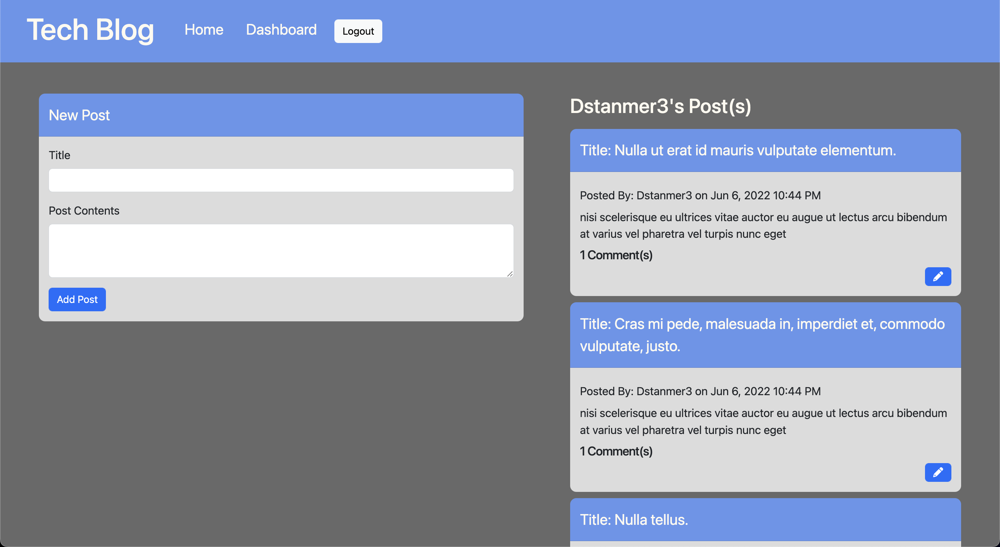
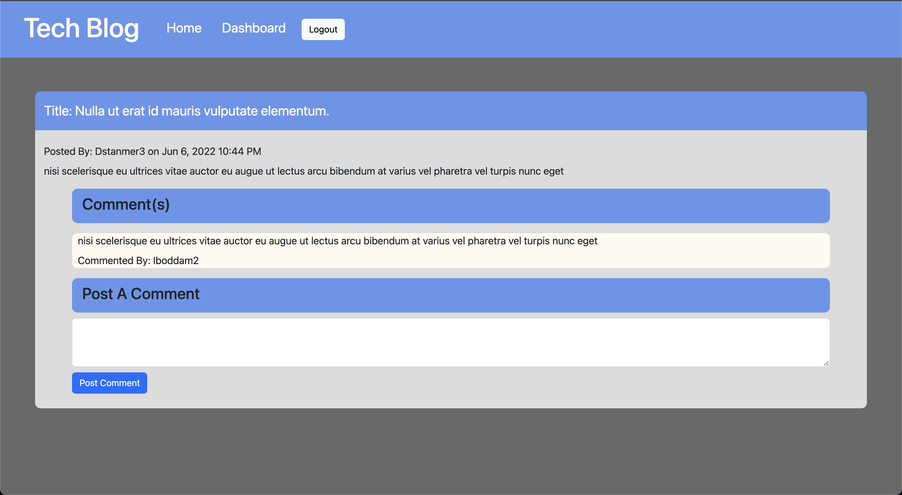
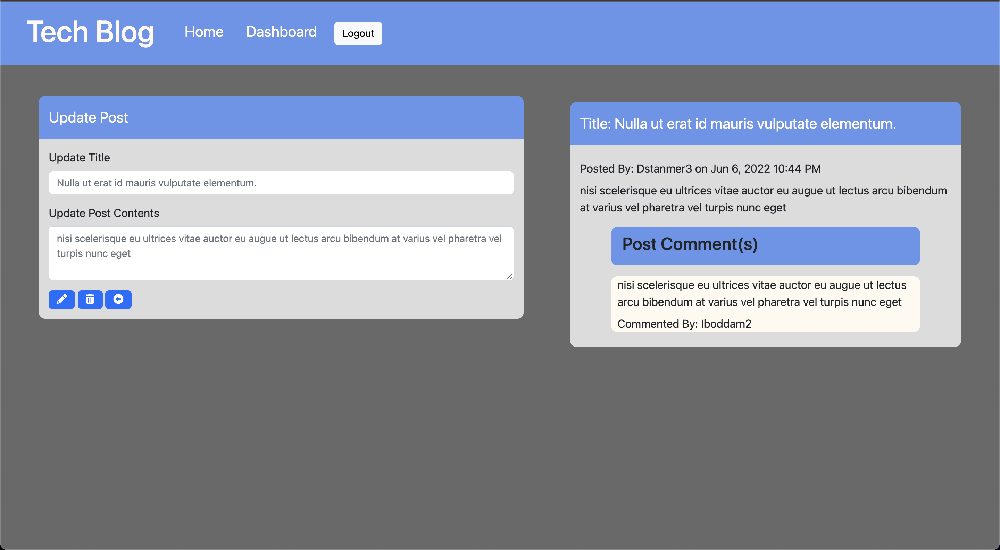

# Tech Blog

## Table of Contents
 * [Description](#Description)
 * [Usage](#Usage)
 * [Contribution](#Contribution)
 * [License](#License)
 * [Questions](#Questions)

## Description
Tech Blog is a CMS style blog web application where a user can post thoughs about different technological advances and comment on other users posts. Users can sign in to maintian an account where they will have access to all their post and additional features that only logged in users have access to. To sign up please visit https://salty-brook-93193.herokuapp.com/ and become a tech blogger today!

## Built With
 * JavaScript
 * HTML
 * CSS
 * Bcrypt
 * Bootstrap
 * DayJs
 * MySQL2
 * Sequelize
 * Express
 * Express-Sessions
 * Express-Handlebars

## ScreenShot

## Usage
To use Tech Blog simple go to the address mentioned above, click on the sign in link in the nav bar and either sign in or sign up. Once signed in you can now add post from your dashboard, edit previous post or add comments to other users' posts.

## Contribution
Tech Blog is still a work in process many other features can be added and if you have suggestions or would like to implement a feature, please fork the application from https://github.com/omcewan/mcewans-tech-blog and once you have finished implementing your feature submit a pull request for approval. 

## License
This application is covered under the MIT.
For more details about licensing, use this link: https://choosealicense.com/licenses/mit/.

## Questions
For additional information about the project, please find it at the following www.github.com/omcewan.
Also if you have additional questions please contact me at orlandomcewan231@gmail.com.
